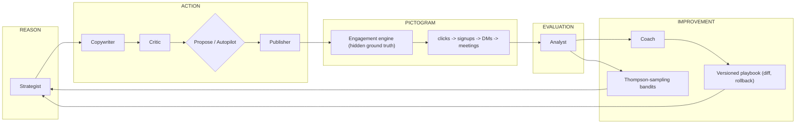

# Flywheel

**A self-improving organic-social GTM agent** — built for the MadeThis "Build a Self-Improving GTM Agent" bounty.

Type any product description. Flywheel spins up **Pictogram** — a simulated Instagram-like platform with ~100 audience personas whose interests, skepticism, purchase intent, and daily rhythms are *hidden ground truth* — then a team of cross-family AI agents grows that product's account from zero: posting, replying, qualifying DMs, and booking meetings. Every outcome, human approval, rejection, and edit feeds a versioned playbook and Thompson-sampling bandits, and the agent's next actions **visibly change**. The endgame demo move: reveal the hidden config and show the agent discovered the audience's true preferences.

Most entries in this space are cold-outbound SDR clones with hand-waved outcomes. Flywheel inverts the bounty's "simulate sends" safety rule into the product itself: because the market is simulated with ground truth, the learning loop is *measurable* — reply-rate curves, posterior shifts, and calibration are real, not narrated.

## The loop



## Models — who does what, and why two families

| Role | Model family | Job |
|---|---|---|
| Strategist | Claude (`MODEL_ACTOR`) | Picks the next best action; cites playbook rule IDs + bandit stats; predicts effect ranges (scored for calibration) |
| Copywriter | Claude | Captions, hashtags, creative briefs per voice rules |
| Coach | Claude | Distills outcomes + human feedback into playbook rule deltas |
| Red-team Critic | GPT (`MODEL_JUDGE`) | Pre-flight review: brand safety, spam risk, guardrails |
| Analyst | GPT | Post-hoc: actual vs predicted, factor attribution, lessons |
| Community Mgr | GPT (`MODEL_CHEAP`) | DM replies; 3-turn qualification → meeting booked / disqualified |
| Persona voices | GPT (cheap) | In-character comments and DMs for the simulated audience |
| Art Director | `MODEL_IMAGE` | Hero-post images, budget-capped |

**Actors and their evaluators are deliberately different model families.** LLM judges systematically favor their own outputs (~10% for GPT-4o, up to ~25% for Claude models, plus same-family bias — Panickssery et al., [arXiv:2410.21819](https://arxiv.org/abs/2410.21819)). Claude acts; GPT judges. The evaluation signal that drives learning is independent of the writer by construction.

## Self-improvement = behavior change, not stored notes

1. **Outcome learning** — the Analyst grades every post against the Strategist's predicted ranges; rewards update bandit posteriors (4 archetypes × 3 time slots) and become playbook rule proposals.
2. **Human-feedback learning** — every rejection captures a reason; every inline edit is diffed and distilled into rules. The next proposal cites the new rules by ID.
3. **Calibration** — predicted-vs-actual is tracked; the Strategist is told how over/under-confident it currently is and gets better at *predicting*, not just choosing.

The playbook is full-copy versioned: human-editable, diffable, and revertible, with bandit posteriors snapshotted per version.

## Permissions, guardrails, trust

- **Propose mode** (default): every action becomes an approval card — action, target, reasoning, evidence, predicted effect, risk class — with Approve / Reject-with-reason / Edit-inline.
- **Autopilot**: acts within caps (posts/day, DMs/day, quiet hours, image + token budgets, banned topics) enforced by a single guardrail gate. Sensitive actions (first-touch DMs, pricing posts) **always** require approval.
- Full activity trail, pause switch, playbook rollback. Agent-call failures quarantine into the trail; the loop never crashes.

## Quickstart

```bash
asdf install                 # Node 22.23.2 (pinned in .tool-versions)
cp .env.example .env.local   # mock mode needs NO API keys
npm i
npm run db:seed              # schema self-bootstraps; seeds a demo world
npm run dev                  # http://localhost:3000
```

Everything runs offline in mock mode (`MODEL_MODE=mock`, the default): heartbeat, approvals, simulation, learning. For live model calls, fill `ANTHROPIC_API_KEY` + `OPENAI_API_KEY` in `.env.local` and validate with `npm run smoke`.

Try the loop: top bar → **Run heartbeat** → open **Approvals**, read the proposal's reasoning and evidence chips → Approve one → **+1 day** → watch the **Feed** fill with engagement and the **Activity** trail record strategist → critic → human → publisher → analyst → coach.

## Repo map

- `src/lib/sim/` — Pictogram: genesis, engagement engine, funnel, ambient content, clock (Track A)
- `src/lib/agents/` + `src/lib/learning/` — model registry, orchestrator, runners, bandits, playbook, guardrails (Track B)
- `src/app/` — Mission Control UI (Track C)
- `docs/ARCHITECTURE.md` — module contracts · `docs/DEMO.md` — demo script · `docs/DECISIONS.md` — ADR log · `CONTRIBUTING.md` — workflow + authorship policy
- `docs/superpowers/` — design spec + task-by-task implementation plan

## Bounty judging map

End-to-end GTM impact: full simulated funnel to booked meetings · Learning loop: playbook diffs + bandit posteriors + calibration · Trust: propose/autopilot, caps, trail, rollback · UX: Mission Control with evidence-citing proposals · Originality: simulated-market-with-ground-truth + cross-family judging. Bonuses: proactive heartbeat, experiment selection, editable memory, rollback, budget caps.

*Hackathon build in progress — see `docs/PROGRESS.md` for live status.*
